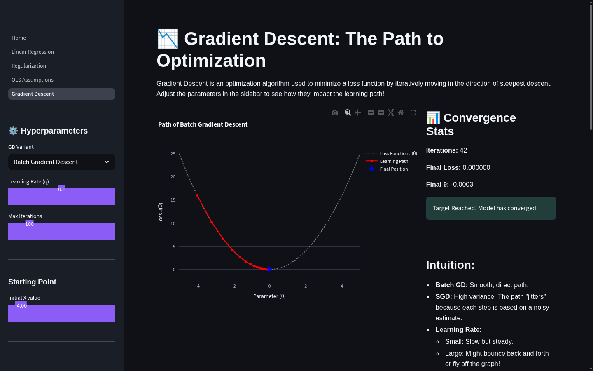

<p align="center">
  <picture>
    <source media="(prefers-color-scheme: dark)" srcset="landing_page_final.png">
    
  </picture>
</p>

<h1 align="center">ML Algorithms Visualized</h1>

<p align="center">
  <strong>See ML. Understand ML. Ace the Interview.</strong>
  <br>
  Interactive visualizations that make ML concepts click. Literally. Tweak any parameter, watch algorithms respond in real-time, and walk into your interview with intuition, not memorized answers.
</p>

<p align="center">
  <a href="https://ml-visualized.streamlit.app/">
    
  </a>
  <a href="#-whats-inside">
    
  </a>
  <a href="https://github.com/Ajeesh25353646">
    
  </a>
</p>

---

## 🎯 What This Is

Most ML resources make you choose: **read the math** or **see a demo**. This is both.

Each visualization is a hands-on playground where you:

- **Drag sliders** to change learning rates, penalty strengths, and noise levels. See the impact instantly.
- **See the math move**. Residuals, loss surfaces, and coefficient tables update as you tweak.
- **Prep for interviews**. Every page ends with question/answer breakdowns that interviewers actually ask.

Zero setup. Zero signup. Just open and learn.

---

## 🚀 Live Demo

**[Launch the App →](https://ml-visualized.streamlit.app/)**

---

## 🧠 What's Inside

### Currently Live (4 Visualizations)

| Visualization | What You Can Do |
|---------------|----------------|
| **Linear Regression** | Fit a line by hand. Watch residuals appear as vertical bars. Compare your MSE against the optimal OLS solution. |
| **Regularization** | Compare Ridge, Lasso, and ElasticNet side-by-side. See the coefficient table change as alpha increases. |
| **Gradient Descent** | Follow the optimization path with Batch GD, SGD, or Mini-Batch. Crank the learning rate and watch it diverge. Includes an interactive 3D loss landscape. |
| **OLS Assumptions** | Full diagnostic suite with Q-Q plots, homoscedasticity checks, VIF calculator, and Durbin-Watson test. |

### Coming Soon

K-Means, Bias-Variance Tradeoff, Evaluation Metrics, Random Forest, Gradient Boosting, PCA, Neural Networks, CNNs, Transformers, and more.

---

## 🛠️ Run Locally

```bash
pip install -r requirements.txt
streamlit run Home.py
```

---

## 📐 Tech Stack

**Python · Streamlit · Plotly · scikit-learn · NumPy · SciPy**

---

## 🎓 For Interview Prep

Each visualization is designed to answer the questions interviewers actually ask:

- *"What happens if two features are highly correlated?"* → Run the Regularization page. See Ridge share weights between correlated features while Lasso picks one.
- *"Why does Lasso zero out coefficients but Ridge doesn't?"* → The geometry is in the coefficient table. Watch it happen live.
- *"How does learning rate affect convergence?"* → Push the slider to 2.0 on the Gradient Descent page and watch it fly off the graph.
- *"What are the OLS assumptions?"* → The diagnostics page checks all four with live plots.

---

## 👨‍💻 Author

**Ajeesh Garg** · [LinkedIn](https://linkedin.com/in/ajeeshgarg) · [GitHub](https://github.com/Ajeesh25353646)

---

<p align="center">
  <em>More visualizations added every week.</em>
  <br>
  <strong><a href="https://ml-visualized.streamlit.app/">Try it now →</a></strong>
</p>
